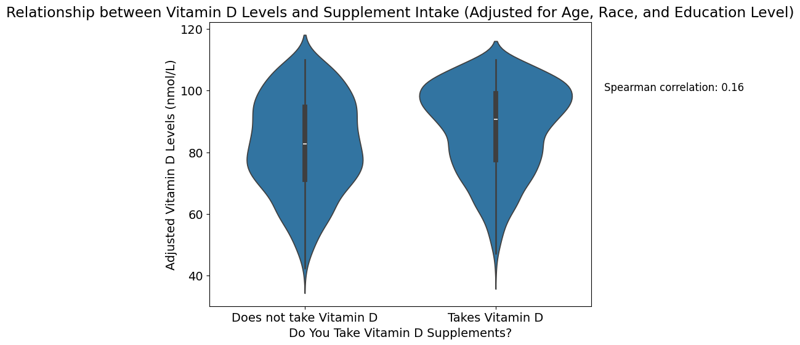

# NHANES Cardiometabolic Profile Analysis

**Exploring how demographics, body measures, blood pressure, and supplement use relate to cardiometabolic lab markers in a U.S. population.**

> **Portfolio Project:** Reproducing established cardiometabolic associations using NHANES data with Python and data science best practices.

---

## 🚀 Key Highlights

- **Waist circumference** is the strongest anthropometric predictor of cardiometabolic lab markers.  
- **Vitamin D supplement use** positively correlates with serum vitamin D levels, even after adjusting for age, race, and education.  
- **Females** have higher HDL cholesterol than males.  
- Fasting plasma glucose rises with **age** and higher blood pressure categories.  
- Laboratory markers cluster in patterns consistent with **metabolic syndrome** and **insulin resistance**.

---

## 🔗 Project Navigation

- **[Full Report](report/analysis_report.md)** – Detailed narrative, methods, results, and conclusions  
- **[Jupyter Notebooks](notebooks/)** – Data compilation, step-by-step code, visualizations, and inline interpretations  
- **[Figures Folder](figures/)** – All visualizations used in analysis and report  
- **[Cleaned Dataset](data/nhanes_final_dataset.csv)** – Data used for analysis  

---

## 📊 Signature Figures

| Anthropometry vs Labs | Serum Vitamin D by Vitamin D Supplement Use |
|-------------|---------------------|
|  |  |

### Correlation Heatmap of Laboratory Markers

> The cells highlighted in **gold** are statistically significant.

---

## 🧪 Methods at a Glance

- **Design:** Cross-sectional analysis of NHANES  
- **Variables:** Demographics, anthropometry, blood pressure, supplement use, lab markers  
- **Statistical Approach:**  
  - Spearman correlation for continuous variables  
  - Kruskal–Wallis tests for categorical comparisons  
  - Adjusted for key demographics (age, sex, race, education) **for supplement-lab associations only**  
  - Other analyses (anthropometry vs labs, BP vs labs, lab-to-lab correlations) were exploratory, focusing on effect sizes and observed patterns rather than adjusted causal inference  
- **Focus:** Effect sizes, biological plausibility, and reproducibility of known associations

---

## 🛠 Tools & Skills

- **Programming & Analysis:** Python, pandas, NumPy, SciPy, statsmodels, matplotlib, seaborn, Jupyter Notebook  
- **Data Science Skills:** Data cleaning, exploratory data analysis, statistical testing, visualization, interpretation of cardiometabolic patterns  
- **Portfolio Value:** Translating population-level health data into reproducible, actionable insights

---

## ⚠️ Limitations

> **Transparent disclosure for statistical rigor:**

- Cross-sectional design limits causal inference.  
- Self-reported supplement use may introduce recall bias.  
- Some distributions affected by ceiling/floor effects and survey weighting considerations.  
- Unmeasured lifestyle or environmental factors could confound associations.  
- Some analyses (anthropometry, blood pressure, lab-to-lab correlations) were exploratory and not adjusted for confounders; results should be interpreted as observed patterns, not causal effects.

---

## 🧭 How to Explore

1. Scan **Key Highlights** for quick insights.  
2. Open **notebooks/02_data_analysis.ipynb** for detailed code, analysis, and figures.  
3. Read **report/analysis_report.md** for the full narrative and interpretation.  
4. Browse **figures/** to see all plots referenced in the notebook and report.  

---

## 🙏 Acknowledgements

Data source: **National Center for Health Statistics (NCHS), Centers for Disease Control and Prevention (CDC)**

