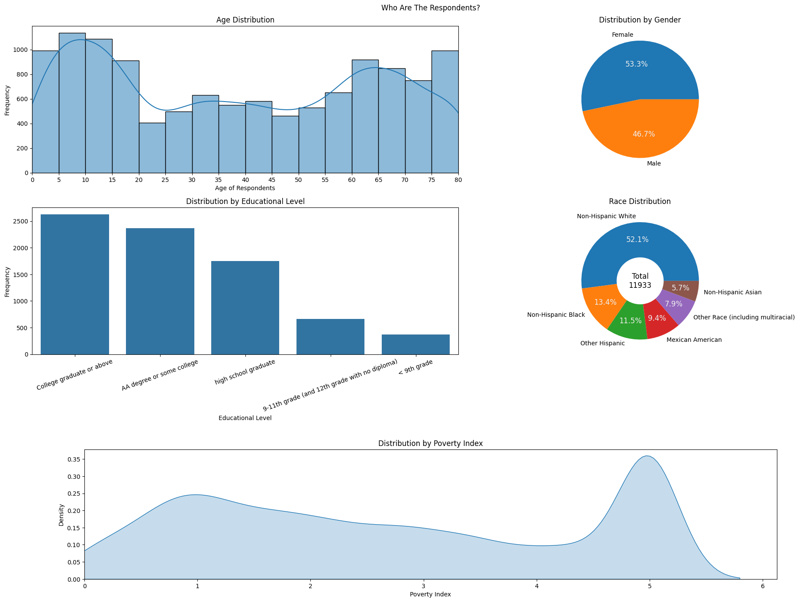
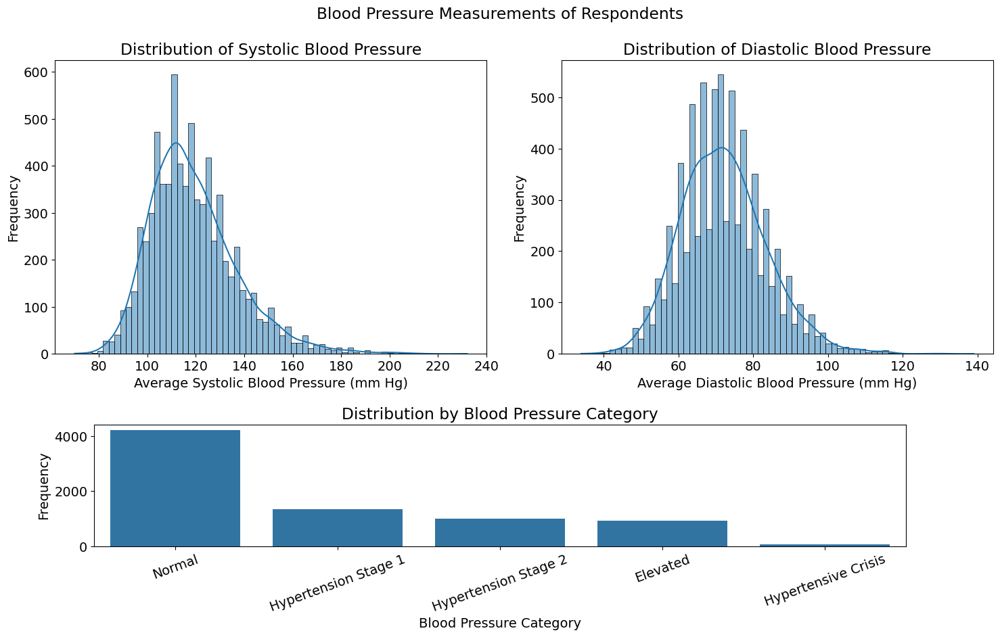
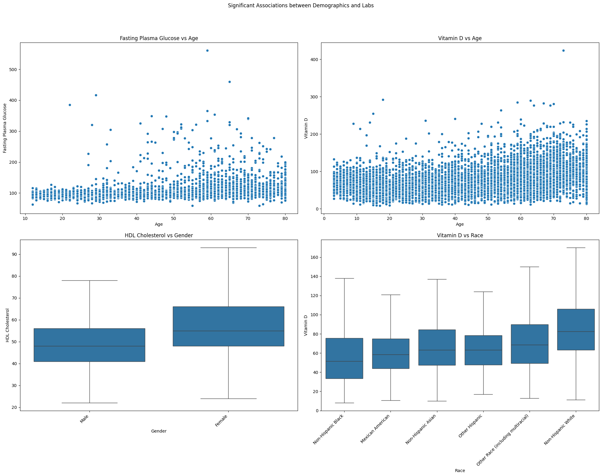
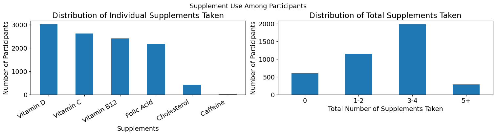
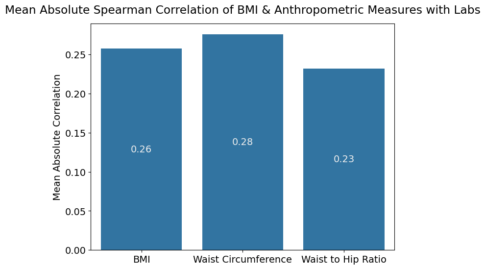
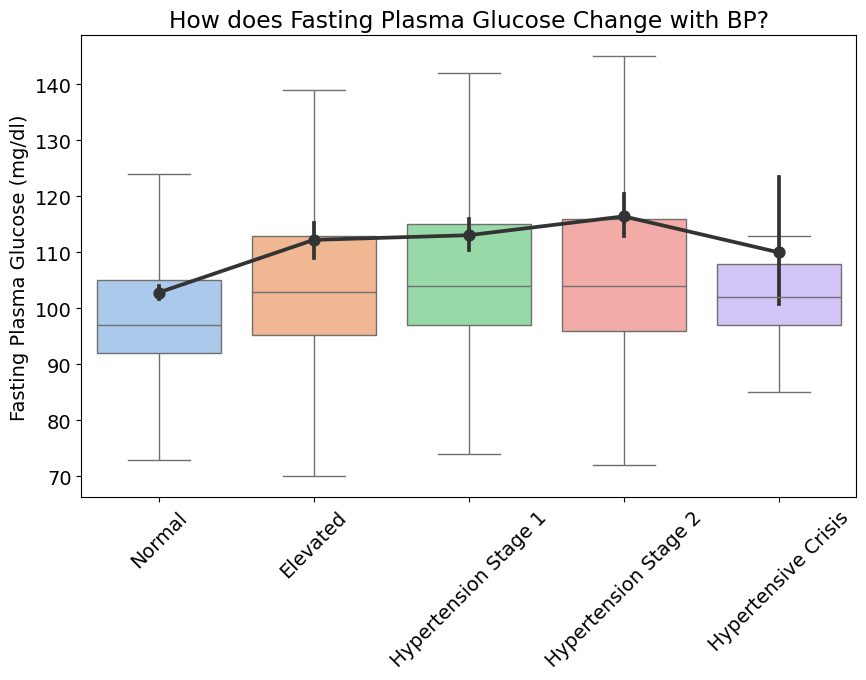
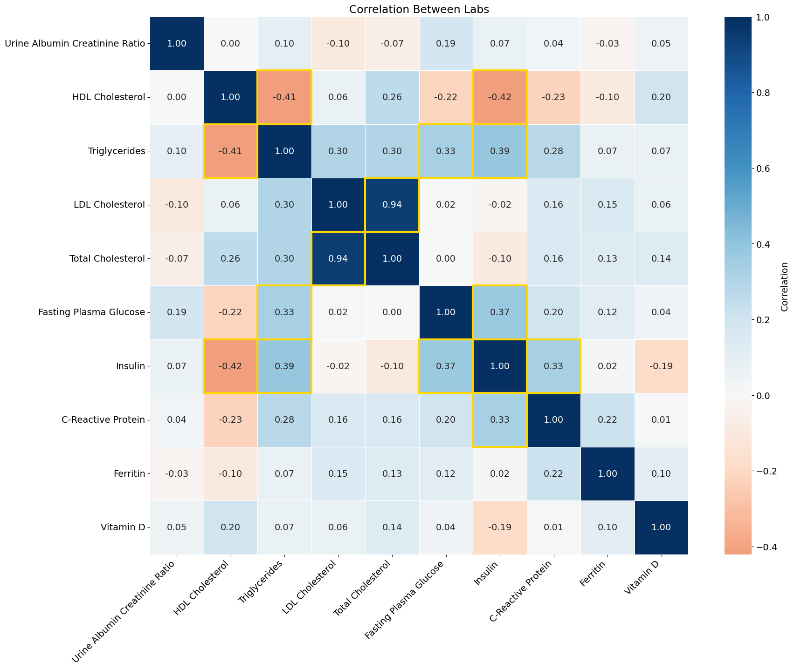

# NHANES Cardiometabolic Profile Analysis Report

---

## Background

Cardiometabolic risk is influenced by interactions between demographic factors, body composition, blood pressure, lifestyle behaviors, and biochemical markers. Population-level datasets allow these relationships to be explored at scale and compared with established clinical and biological knowledge.

The National Health and Nutrition Examination Survey (NHANES) is a nationally representative, cross-sectional survey that combines interview data, physical examinations, supplement use, and laboratory measurements. This makes it well suited for exploratory analyses of cardiometabolic health in the general population.

Anthropometric measures such as body mass index (BMI), waist circumference, and waist-to-hip ratio (WHR) capture different aspects of adiposity, with central fat measures often showing stronger associations with metabolic dysfunction. Laboratory markers including glucose, insulin, lipid fractions, inflammatory markers, and micronutrient levels provide insight into metabolic and cardiometabolic status.

This analysis explores associations between demographics, anthropometry, blood pressure, supplement use, and cardiometabolic laboratory markers in NHANES, focusing on effect sizes and biologically plausible patterns rather than causal inference.

---

## Objectives

1. Describe the characteristics of the NHANES respondents.  
2. Examine associations between **demographics** and laboratory markers.  
3. Assess whether **supplement use** is associated with corresponding laboratory markers.  
4. Compare **anthropometric measures** (BMI, waist circumference, WHR) in predicting laboratory markers.  
5. Explore associations between **blood pressure** and laboratory markers.  
6. Examine correlations between **laboratory markers** themselves.

---

## Methods

- **Study Design:** Cross-sectional analysis of NHANES data.  
- **Variables:**  
  - Demographics: age, sex, race, education, poverty index  
  - Anthropometry: BMI, waist circumference, WHR  
  - Blood pressure: average systolic BP, average diastolic BP, BP category  
  - Supplement use: Vitamin D, Vitamin C, Vitamin B12, folic acid, cholesterol, caffeine  
  - Laboratory markers: Fasting plasma glucose (FPG), insulin, HDL, LDL, total cholesterol, triglycerides, hs-CRP, serum vitamin D, ferritin, urinary albumin-to-creatinine ratio (UACR)  
- **Statistical Approach:**  
  - Non-parametric methods were applied due to skewed distributions:
    - Spearman correlation for continuous variables  
    - Kruskal–Wallis tests for categorical comparisons  
  - Adjusted for key demographics (age, sex, race, education) **for supplement-lab associations only**  
  - Other analyses (anthropometry vs labs, BP vs labs, lab-to-lab correlations) were exploratory, focusing on effect sizes and patterns rather than adjusted causal inference

---

## Results

### 1. Respondent Characteristics

- Age distribution was bimodal: one peak in children/adolescents, another in older adults (~55–75 years).  
- Sex distribution: roughly equal males and females.  
- Education: majority with college or some college; fewer with less than high school.  
- Race/Ethnicity: predominantly Non-Hispanic White (~52%), other groups represented in smaller proportions.  
- Poverty index: bimodal distribution, peaks at 1.0 and 5.0 (right-skewed overall).  
- BMI: mean in the overweight range, with a long tail toward obesity.  
- Waist circumference: right-skewed, mean relatively high.  
- WHR: more symmetric, mean ~0.9–0.95.  
- Blood pressure: mean SBP 119 mmHg, DBP 72 mmHg; majority had normal BP.

#### Figure 1: Demographic distribution

#### Figure 2: Anthropometry and BP

---

### 2. Demographics vs Laboratory Markers

- **HDL:** higher median in females, with greater variability.  
- **FPG:** moderate positive correlation with age.  
- **Serum Vitamin D:** moderate positive correlation with age; lower in Non-Hispanic Blacks, higher in Non-Hispanic Whites.

#### Figure 3: Demographics vs Labs

---

### 3. Supplement Use vs Laboratory Markers

- Vitamin D was the most used supplement, followed by Vitamin C, Vitamin B12, folic acid, cholesterol, and caffeine.  
- Most respondents took 3–4 supplements; caffeine was least used.  
- **Significant association:** Vitamin D supplement with serum vitamin D (Spearman ρ = 0.40), reduced to 0.16 after adjustment for age, race, and education.

#### Figure 4: Supplement Usage Counts

---

### 4. Anthropometry vs Laboratory Markers

| Measure | Strongest Correlations |
|---------|----------------------|
| BMI     | CRP (0.58), insulin (0.54), FPG (0.30), triglycerides (0.33) |
| Waist Circumference | CRP (0.57), insulin (0.53), FPG (0.40), triglycerides (0.40), HDL (-0.32) |
| WHR     | CRP (0.30), insulin (0.33), FPG (0.45), triglycerides (0.41), HDL (-0.36) |

- Mean absolute Spearman correlation: Waist circumference (0.28) > BMI (0.26) > WHR (0.23).  
- Waist circumference emerged as the strongest predictor of lab markers.

#### Figure 5: Waist Circumference vs FPG

---

### 5. Blood Pressure vs Laboratory Markers

- Only **BP category** showed a significant association with FPG.  
- Average systolic and diastolic BP were not significantly correlated with lab markers.  
- FPG generally increased with BP category, except hypertensive crisis, where it decreased slightly (still higher than normal BP class).

#### Figure 6: FPG by BP Category

---

### 6. Laboratory Marker Correlations

- Insulin positively correlated with triglycerides (0.39), FPG (0.37), hs-CRP (0.33); negatively with HDL (-0.42).  
- Triglycerides positively correlated with FPG (0.33).  
- Patterns align with known metabolic syndrome clustering.

#### Figure 7: Lab Correlation Heatmap

---

## Discussion

- Anthropometric measures, particularly **waist circumference**, are strong predictors of cardiometabolic risk markers.  
- **Vitamin D supplementation** affects serum levels even after adjusting for demographic confounders.  
- Sex and age differences in HDL and FPG are consistent with epidemiological evidence.  
- Exploratory correlations between labs reflect expected metabolic clustering, providing internal validation of the dataset and analysis.  
- Blood pressure shows modest association with FPG but less so with other labs, consistent with prior literature.

---

## Limitations

- Cross-sectional design limits causal inference.  
- Self-reported supplement use may introduce recall bias.  
- Some analyses (anthropometry vs labs, BP vs labs, lab-to-lab correlations) were **exploratory and not adjusted for confounders**; results reflect observed patterns, not causality.  
- Some distributions like poverty index affected by ceiling/floor effects and survey weighting considerations.  
- Unmeasured lifestyle or environmental factors may confound associations.

---

## Conclusion

This analysis demonstrates that:

- Waist circumference is a stronger predictor of cardiometabolic laboratory markers than BMI or WHR.  
- Vitamin D supplementation is positively associated with serum vitamin D levels.  
- Observed demographic differences in HDL, FPG, and vitamin D levels align with established clinical knowledge.  
- Exploratory lab correlations reflect metabolic syndrome clustering, validating the analytic approach.

Overall, NHANES provides a robust platform to explore **biologically plausible patterns** in cardiometabolic health across a representative U.S. population, suitable for portfolio demonstration of **data cleaning, analysis, visualization, and interpretation skills**.

---
